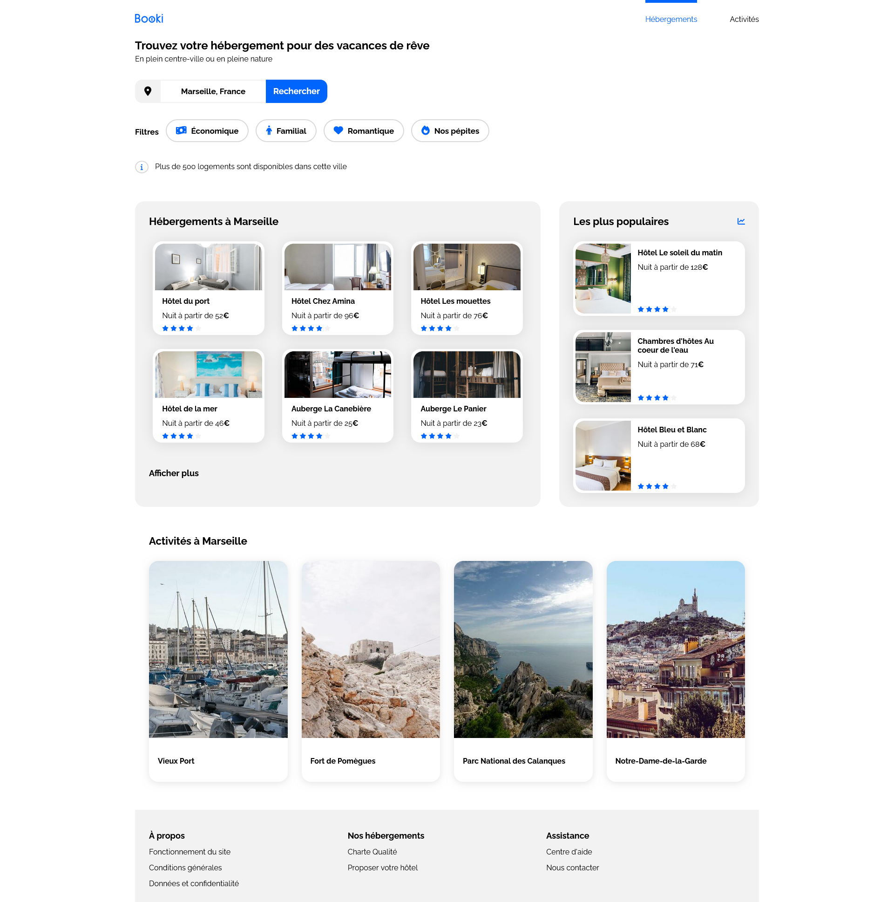

# Booki

L’entreprise Booki souhaite développer un site Internet qui permette aux usagers de trouver des hébergements et des activités dans la ville de leur choix.

Vous êtes chargé d'intégrer l'interface du site avec du code HTML et CSS. Pour cela, vous travaillez en étroite collaboration avec Sarah, la CTO, et Loïc, l’UI designer.

## Réalisation

Mon objectif est de reproduire le design fournis par Loïc, depuis Figma, vers un site afin de **valider l'interface pour une première version**.

Voici le [design figma](https://www.figma.com/file/r9YJyUkpVdrxzBBKGH7reY/Maquettes-Booki-(desktop%2C-mobile%2C-tablette)?type=design&node-id=3-0&mode=design&t=ocmeQSb3IKQ5e7Ry-0) fournis avec le sujet.

*Capture d'écran depuis le site web*

*Note: Ce site à été réaliser avec la méthodologie **Desktop First***